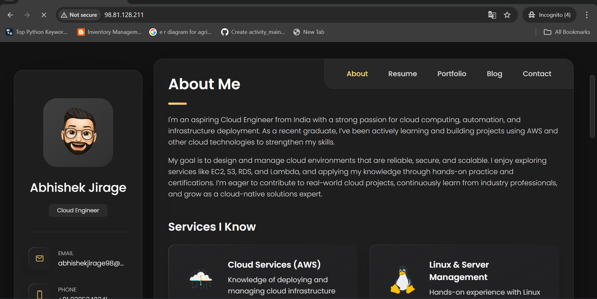
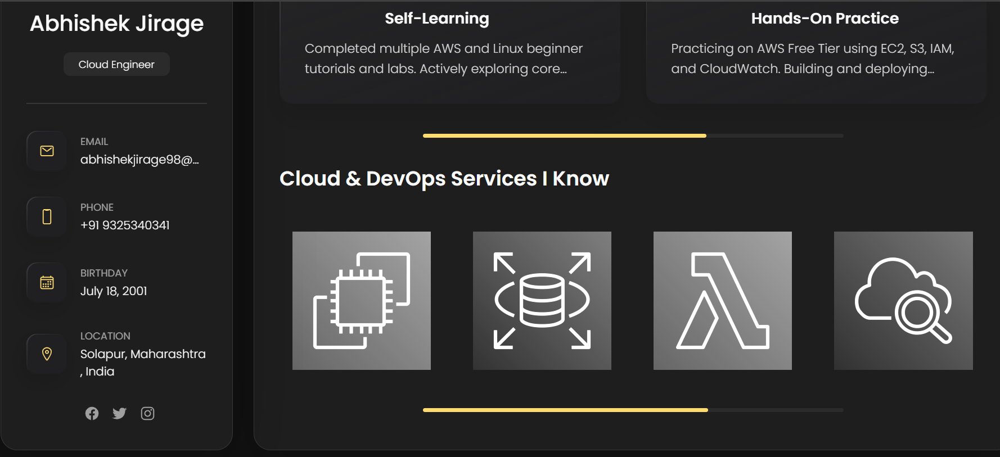
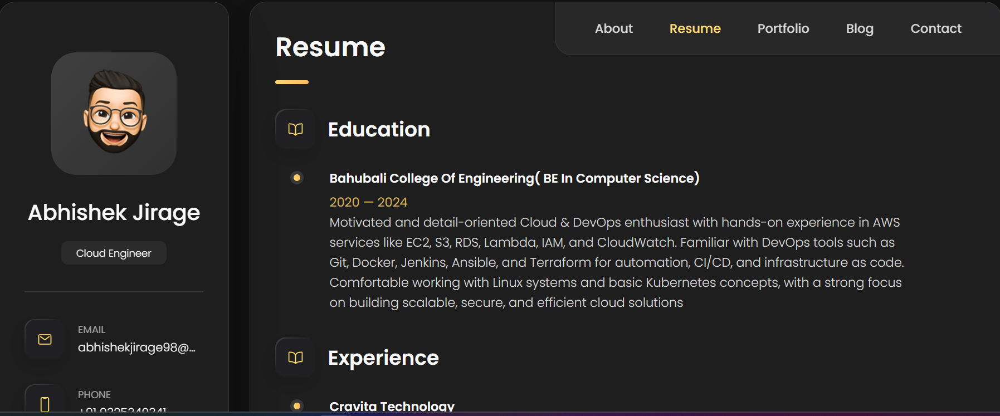
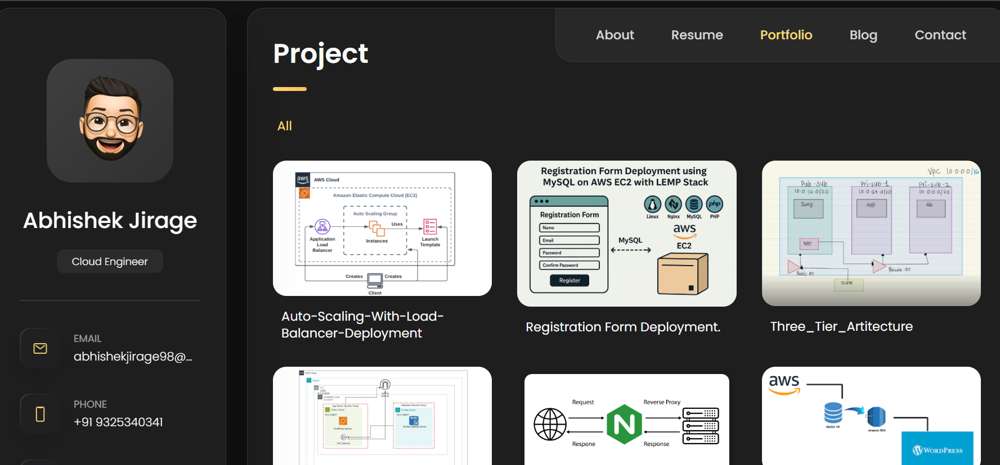
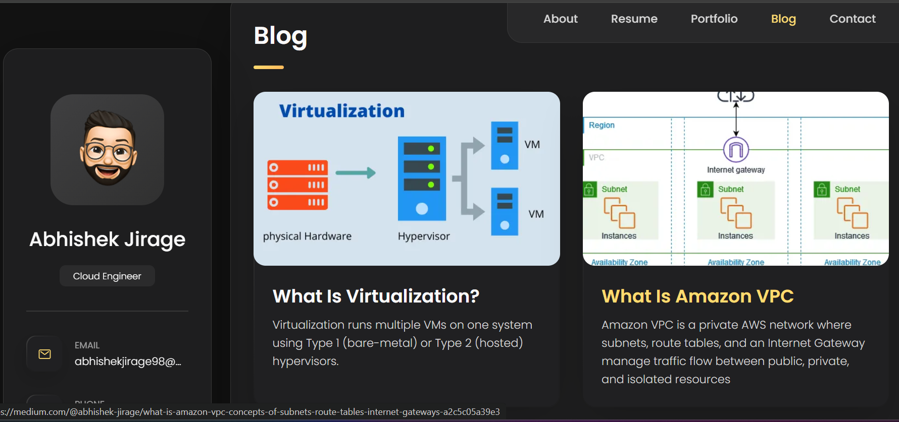

#  Portfolio Deployment – CI/CD with Jenkins  

This project automates the **deployment of my personal portfolio website** using a **Jenkins CI/CD pipeline** and **Apache2 web server** on a remote Ubuntu server.  

---

##  Project Overview  
- **Goal:** Automatically deploy my portfolio to a remote server whenever changes are pushed to GitHub.  
- **Tools Used:** Jenkins, GitHub, Apache2, SSH.  
- **Pipeline:** Uses `Jenkinsfile` with SSH-based deployment.  
- **Trigger:** GitHub Webhook (auto-trigger build on push).  
- **Notifications:** Logs and console output in Jenkins help track build progress.  

---

##  Tech Stack  
- **Frontend:** HTML, CSS, JS (Portfolio Website)  
- **CI/CD:** Jenkins Pipeline (Pipeline-as-Code)  
- **Web Server:** Apache2  
- **Deployment:** SSH + SCP to remote server  
- **Version Control:** Git & GitHub  

---

##  Setup Instructions  

### 1. Install Apache2 on Remote Server  
```bash
sudo apt update
sudo apt install apache2 -y
sudo systemctl enable apache2
sudo systemctl start apache2
```
## 2. Install Jenkins
```
sudo apt update
sudo apt install openjdk-17-jdk -y
curl -fsSL https://pkg.jenkins.io/debian-stable/jenkins.io.key | sudo tee \
  /usr/share/keyrings/jenkins-keyring.asc > /dev/null
echo deb [signed-by=/usr/share/keyrings/jenkins-keyring.asc] \
  https://pkg.jenkins.io/debian-stable binary/ | sudo tee \
  /etc/apt/sources.list.d/jenkins.list > /dev/null
sudo apt update
sudo apt install jenkins -y
sudo systemctl enable jenkins
sudo systemctl start jenkins
```
## 3. Configure Jenkins

* Install Pipeline, SSH Agent, and Git plugins.

* Add a new credential in Jenkins (type: SSH username with private key)

* ID: Jenkins_Node_Server

* Username: ubuntu

* Private Key: your server’s private key (~/.ssh/id_rsa)

* Create a new Pipeline job and point it to this repository.

4. Jenkinsfile (CI/CD Pipeline)<br>
* <a href="C:\Users\abhis\OneDrive\Desktop\My Project\Abhishek_Portfolio\jenkinsfile">Jenkinsfile</a>

## 5. Configure GitHub Webhook

* To enable auto-trigger builds when code is pushed to GitHub:

* Go to your GitHub repository → Settings → Webhooks → Add Webhook

* Enter your Jenkins URL with /github-webhook/ endpoint:
```
http://<your-jenkins-server-ip>:8080/github-webhook/
```
* Content type: application/json

* Select Just the push event

*  Click Add Webhook

## 6. Configure Jenkins Job for Webhooks

* Open your Jenkins Pipeline job → Configure

* Under Build Triggers, check ✅ GitHub hook trigger for GITScm polling

* Save the job

**Now every time you push changes to GitHub, Jenkins will automatically build and deploy your site.**

## 7. Deploy & Verify

Once you run the Jenkins job (or push new code to trigger automatically), open a browser and visit:
```
http://54.221.183.57/
```
## You should see your portfolio website live. 🎉




